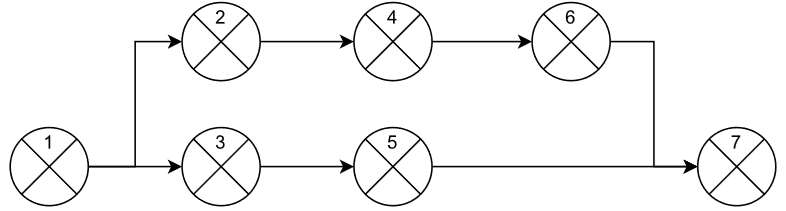
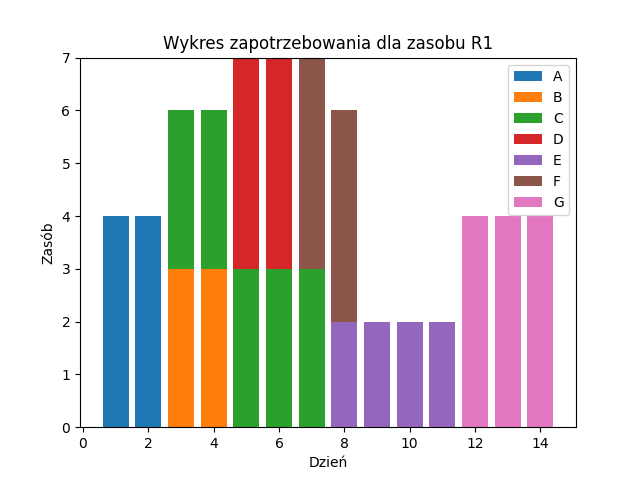
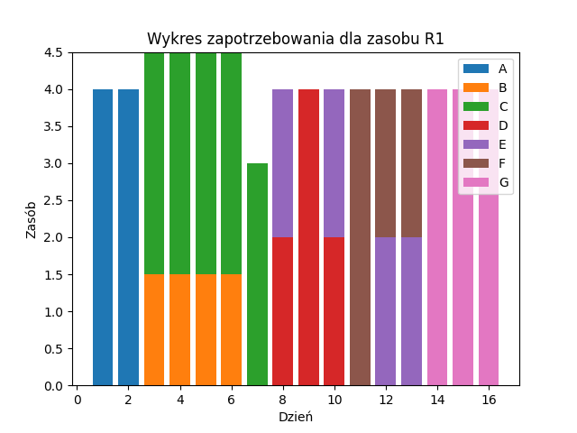

 ## Spis treści
* [General information](#general-information)
* [Options](#options)
* [Technology](#technology)
* [Results](#results)

## General information
The aim of the thesis was to create an application that would balance the need for resources in the project and set a schedule that would help the manager in planning the project. It implements a heuristic genetic algorithm with various methods of crossover, mutation and selection, which searches for a solution by creating new variants. 

## Options

### Selection methods
* Roulette wheel method
* Ranking method

### Crossover methods
* It proceeds through subsequent activities that are not in the critical path, if any
are different from each other, he checks whether he is able to perform crossbreeding for these activities.

### Mutation methods
* Separation of resources
* Allocation resources
* Division of resources over several days
* Adding an extra day

## Technology
The application was created in python 3.9 using libraries
* pandas
* numpy
* matplotlib
* networkx

## Results
Here is an example scenario of a sequence of events in a project

His demand graph looked like this at first:

and after applying the algorithm like this:

this shows how the application works, more examples and results can be found in the work (in Polish) attached to the repository

 
 
